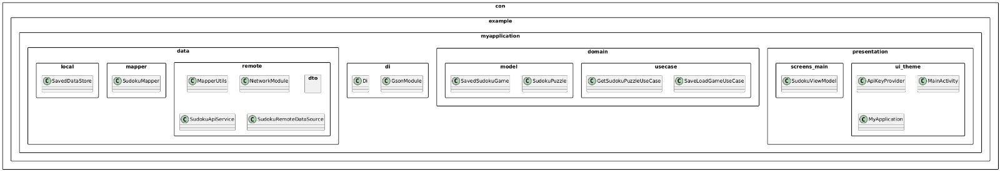

# Examen
Examen TC2007B

## Información del desarrollador
- **Nombre:** Oscar Javier Villeda Arteaga
- **Matrícula:** A

## Plataforma a desarrollar
**Aplicación Android nativa** para dispositivos móviles, desarrollada en Kotlin con Jetpack Compose, siguiendo los principios de Clean Architecture y MVVM.

## Contexto del proyecto
Aplicación educativa de Sudoku que forma parte de un programa nacional para promover el razonamiento lógico en jóvenes estudiantes, integrando gamificación en el aprendizaje STEM.

## Características principales
- Generación de puzzles Sudoku (4x4 y 9x9) con tres niveles de dificultad
- Interfaz interactiva para resolución de puzzles
- Validación de soluciones en tiempo real
- Guardado y carga de partidas en progreso
- Sistema de retroalimentación educativa
- Diseño atractivo para público juvenil

## Requerimientos técnicos
### Arquitectura
- **Clean Architecture** (Capa de Datos, Dominio y Presentación)
- **Patrón MVVM** (Model-View-ViewModel)
- **Inyección de dependencias** con Hilt

### Tecnologías principales
- Kotlin
- Jetpack Compose
- Retrofit (para conexión con API Sudoku de API Ninjas)

### API Externa
- Integración con [Sudoku API de API Ninjas](https://api-ninjas.com/api/sudoku)

## Configuración del proyecto
1. Clonar el repositorio
2. Abrir en Android Studio Arctic Fox o superior
3. Configurar las variables de entorno:
   - Crear archivo `local.properties` con:
     ```
     API_NINJAS_KEY=tu_api_key_aquí
     ```
4. Sincronizar proyecto con Gradle
5. Ejecutar en emulador o dispositivo físico

## Diagrama de Estructura


# Sudoku Educativo - FDC

[](https://opensource.org/licenses/MIT)

Aplicación móvil educativa de Sudoku desarrollada para la Fundación para el Desarrollo Cognitivo (FDC), diseñada para mejorar habilidades lógico-matemáticas en estudiantes.